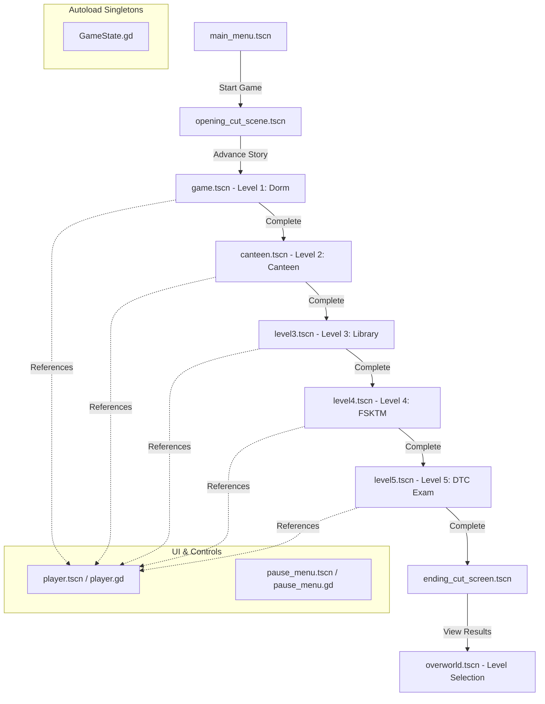

# 🏃‍♂️ UM-Rush (University of Malaya Final Exam Rush)

**UM-Rush** is a fast-paced 2D side-scrolling lane-based runner game built in **Godot 4**. The game tells the frantic story of **Azri**, a student at the University of Malaya (UM) who wakes up late at 7:52 AM and must sprint across campus to reach the Dewan Tun Canselor (DTC) for his final exam at 8:00 AM. 

Players must dodge obstacles, stay awake, grab food, sneak through the library, avoid dead WiFi zones, and answer computer science trivia to get to class on time and ace the exam!

---

## 🎮 Game Controls & Actions

The game relies on standard input maps and dynamic action listeners registered at runtime.

| Key | Input Action | Gameplay Function |
| :--- | :--- | :--- |
| **Up Arrow / W** | `ui_up` | Shift up one lane (3 lanes total) |
| **Down Arrow / S** | `ui_down` | Shift down one lane |
| **Right Arrow / D** | `ui_right` | Move forward / Accelerate |
| **Spacebar** | `snooze` / `ui_accept` | Jump (dodge low obstacles) / Snooze alarm (Level 1) |
| **Shift** | `tiptoe` | Hold to walk silently in the library (Level 3) |
| **Ctrl** | `dash` | Perform a forward dash to pass threats quickly |
| **A** | `roll` | Perform a roll under overhead obstacles |
| **Escape** | `ui_cancel` | Toggle pause menu |

---

## 🏛 Level Breakdown & Unique Mechanics

Each level introduces a distinct campus location and a new survival mechanic:

### 🛌 Level 1: Dorm Corridor
- **Script**: [game.gd](file:///c:/Users/den51/UM-Rush/um-rush/Scene/game.gd) & [alarm_snooze.gd](file:///c:/Users/den51/UM-Rush/um-rush/Scene/alarm_snooze.gd)
- **Mechanic**: Sleepiness meter. Fatigue builds up over time. The player must repeatedly tap **Space** to snooze the alarm and stay awake. Falling asleep results in a Game Over.

### 🍔 Level 2: Canteen Rush
- **Script**: [canteen_game.gd](file:///c:/Users/den51/UM-Rush/um-rush/Scene/canteen_game.gd) & [hunger_meter.gd](file:///c:/Users/den51/UM-Rush/um-rush/Scene/hunger_meter.gd)
- **Mechanic**: Hunger meter. Hunger decays constantly. The player must collect [food.tscn](file:///c:/Users/den51/UM-Rush/um-rush/Scene/food.tscn) items to maintain maximum run speed. Skipping meals causes a drastic drop in velocity.

### 📚 Level 3: Library Run
- **Script**: [level3_game.gd](file:///c:/Users/den51/UM-Rush/um-rush/Scene/level3_game.gd) & [noise_meter.gd](file:///c:/Users/den51/UM-Rush/um-rush/Scene/noise_meter.gd)
- **Mechanic**: Noise meter. Running generates noise. The player must hold **Shift** to tiptoe and drain the noise meter. Making too much noise alerts the librarian, who kicks the player out.

### 📶 Level 4: FSKTM Building
- **Script**: [level4_game.gd](file:///c:/Users/den51/UM-Rush/um-rush/Scene/level4_game.gd) & [wifi_visibility.gd](file:///c:/Users/den51/UM-Rush/um-rush/Scene/wifi_visibility.gd)
- **Mechanic**: WiFi strength. Entering dead WiFi zones drains connection strength. As signal drops, the screen darkens (blindness overlay), making obstacles invisible. Reaching 0% signal triggers a disconnect Game Over.

### 📝 Level 5: Final Exam (DTC)
- **Script**: [level5_game.gd](file:///c:/Users/den51/UM-Rush/um-rush/Scene/level5_game.gd) & [qna_mechanic.gd](file:///c:/Users/den51/UM-Rush/um-rush/Scene/qna_mechanic.gd)
- **Mechanic**: Final Exam. Gameplay stops at checkpoints, prompting multiple-choice Computer Science trivia questions (OOP, Big O notation, data structures, etc.). Correct answers score points; incorrect answers trigger obstacle waves and raise stress levels.

---

## 🛠 Core Architecture & Systems

### 1. Global Game State
The game utilizes a central autoload/singleton [game_state.gd](file:///c:/Users/den51/UM-Rush/um-rush/Scene/game_state.gd) configured in [project.godot](file:///c:/Users/den51/UM-Rush/um-rush/project.godot). It tracks:
- Total accumulated score and current level score.
- Power-ups used and hidden campus cats collected.
- Number of obstacle collisions (`hits`).
- Complete grading logic based on performance:
  ```gdscript
  func calculate_grade() -> String:
      if hits >= 5:
          return "C"
      if current_level_score >= 900:
          return "A+"
      if current_level_score >= 700:
          return "A"
      if current_level_score >= 450:
          return "B"
      if current_level_score >= 200:
          return "C"
      return "F"
  ```

### 2. Player Controller
Defined in [player.gd](file:///c:/Users/den51/UM-Rush/um-rush/Scene/player.gd), this script controls character physics:
- **3-Lane Lane-Switching**: Smooth interpolation between lane Y positions (`[-200.0, 0.0, 200.0]`).
- **Jump Arc**: Custom vertical velocity and gravity logic to simulate jump flight.
- **Roll and Dash**: Temporal collision mask overrides to slide under obstacles or dash forward.
- **Powerups**: Speed multipliers and custom-drawn Line2D pulse shield visual effects.

### 3. Obstacles and Entities
Spawning is dynamically handled in level scripts:
- **Obstacles**: [obstacle.gd](file:///c:/Users/den51/UM-Rush/um-rush/Scene/obstacle.gd) represents school desks and blocking objects.
- **Enemies**: [enemy.gd](file:///c:/Users/den51/UM-Rush/um-rush/Scene/enemy.gd) handles moving vehicles/threats with pattern types like `straight`, `wave`, and `lane_shift`.
- **Collectibles**: Includes [power_up.gd](file:///c:/Users/den51/UM-Rush/um-rush/Scene/power_up.gd) (speed, stress relief, shield) and hidden [campus_cat.gd](file:///c:/Users/den51/UM-Rush/um-rush/Scene/campus_cat.gd).

---

## 🗺 Scene Flow



---

## 🚀 How to Run the Project

> [!IMPORTANT]
> The game is built using **Godot Engine 4.6 (GL Compatibility render mode)**. Ensure you have the compatible engine binaries.

1. **Clone the Repository**:
   Make sure you have the files on your local drive.
2. **Open Godot Engine**:
   Click **Import** and select the [project.godot](file:///c:/Users/den51/UM-Rush/um-rush/project.godot) file located inside the `um-rush` folder.
3. **Play**:
   Press **F5** (or the play icon in the top right corner) to start from the Main Menu.

---

## 📂 Codebase Navigation

Key folders and files:
- **Scenes & Logic**: Refer to the [Scene](file:///c:/Users/den51/UM-Rush/um-rush/Scene) directory containing GDScript logic and corresponding `.tscn` layouts.
- **Game Assets**: Refer to the [assets](file:///c:/Users/den51/UM-Rush/um-rush/assets) folder containing visual sprites, backgrounds, and font sheets (GrapeSoda.ttf).